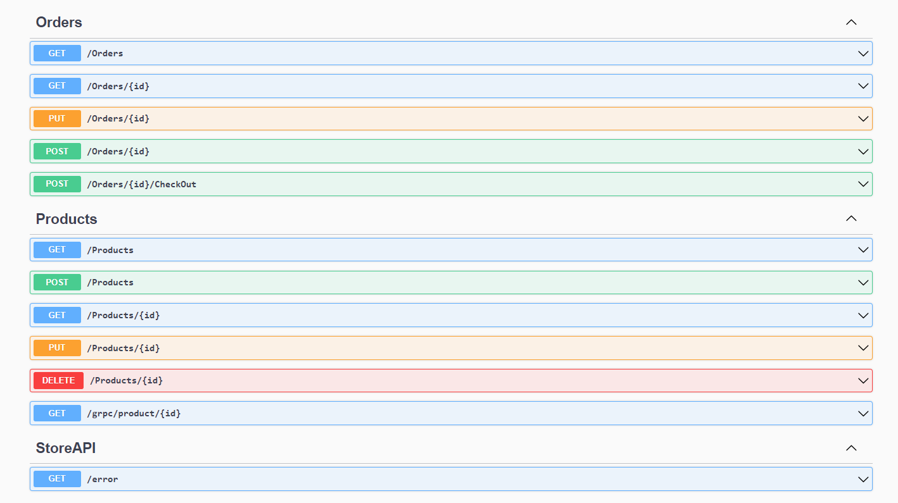
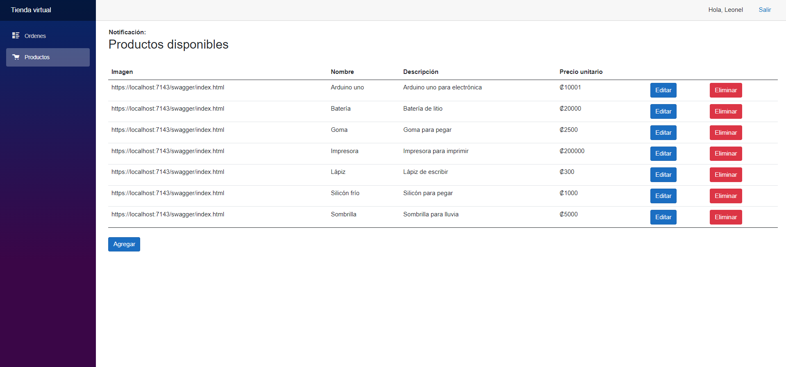
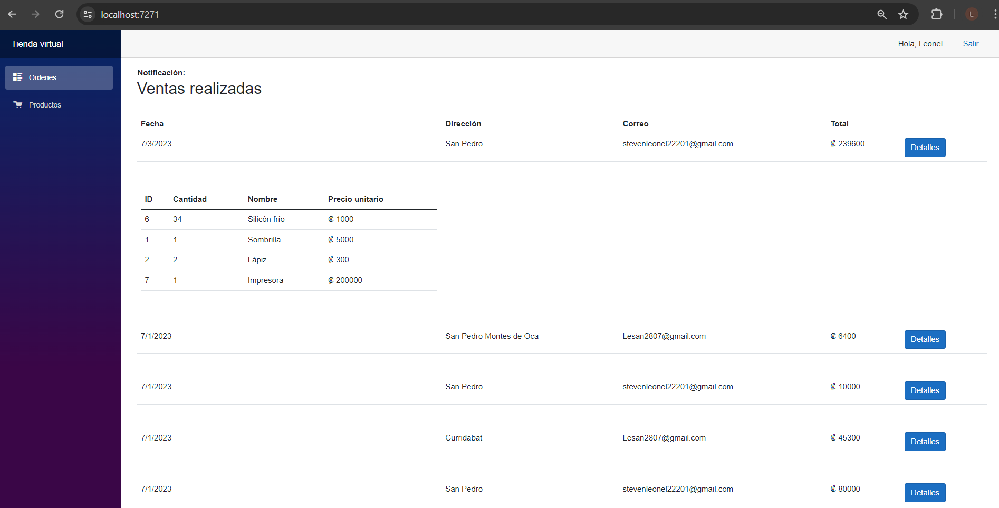
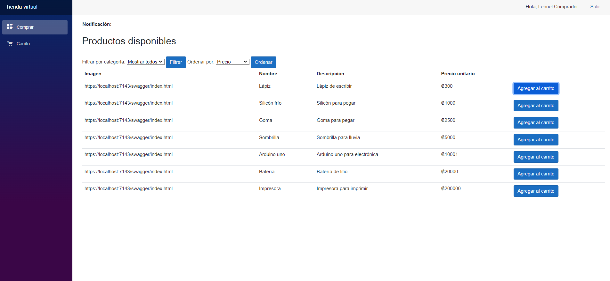
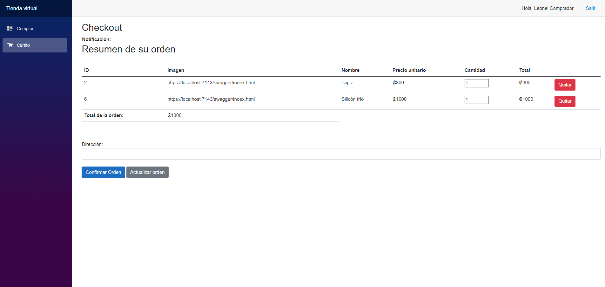
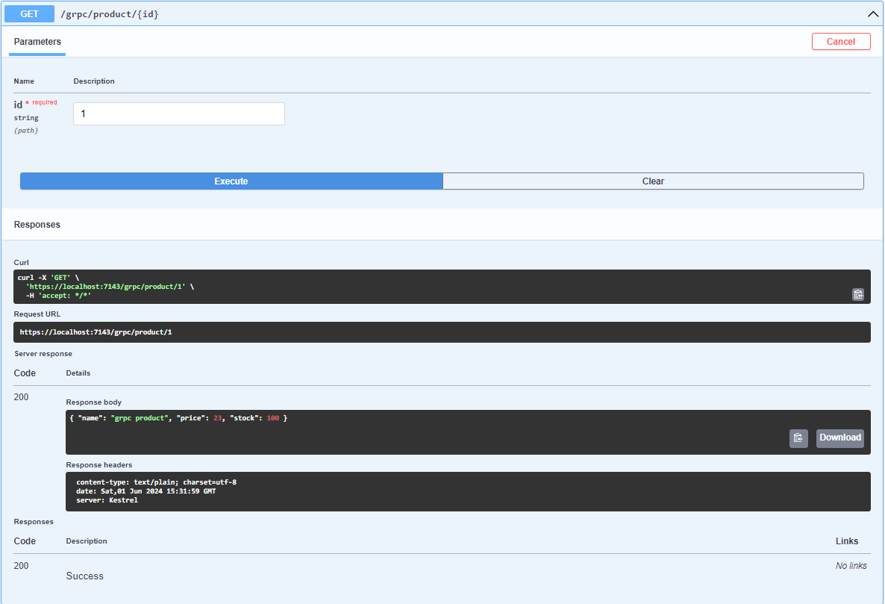
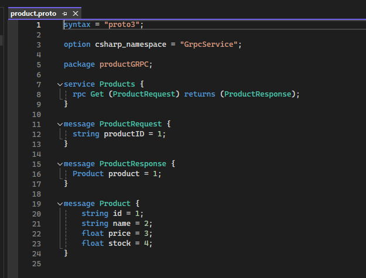
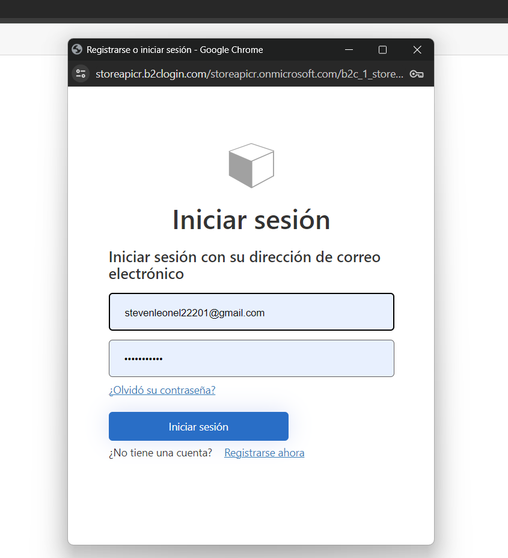
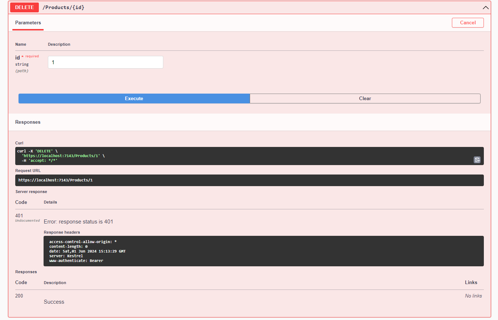
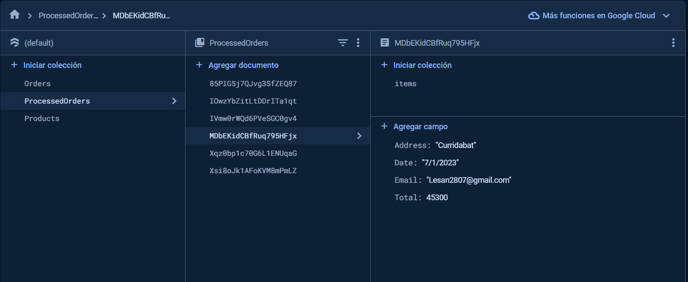

## StoreAPI

## Project Overview
The main objective of this project was to learn how to design and implement a Restful API. The application is designed to manage users and roles effectively, catering to both clients and store owners.

- **Backend**: The backend, built with .NET Web API 6.0, handles various endpoints to manage orders, products, and store-specific functionalities. The API supports standard CRUD operations (Create, Read, Update, Delete) for orders and products, ensuring robust data management. The endpoints are documented using OpenAPI, providing a clear and interactive interface for developers to understand and interact with the API.

- **Client Side**: On the client side, Blazor WebAssembly offers a rich, interactive user experience. The combination of .NET Web API 6.0 and Blazor WebAssembly provides seamless functionality for the users.
<table>
  <tr>
   <td> Store owner</td>
    <td></td>
    <td></td>
  </tr>

   <td> Client</td>
    <td></td>
    <td></td>
  </tr>
</table>

## Key Features
- **gRPC Service**: Implemented a sample gRPC service to demonstrate the use of modern, high-performance GRPC framework alongside RESTful services.
<table>
  <tr>
    <td>
      
    </td>
    <td>
      
    </td>
  </tr>
</table>

- **Azure AD B2C Integration**: Integrated Azure AD B2C for comprehensive user and role management, allowing seamless authentication and authorization.

- **JWT and Bearer Tokens**: Secured API endpoints using JSON Web Tokens (JWT) and Bearer tokens to ensure that only authenticated users can access the services.

- **Firebase Document Database**: Firebase is utilized as a document database offering scalability and flexibility for data storage needs.

- **Postman Testing**: Conducted extensive testing of the API endpoints using Postman to ensure reliability and performance.

